# Лабораторная работа №4

## Тема: Проектирование REST API

## Цель работы: Получить опыт проектирования программного интерфейса


## 1. Теоретические основы

REST (Representational State Transfer) --- архитектурный стиль
построения распределённых систем, основанный на использовании
HTTP-протокола и ресурсно-ориентированного подхода.

Основные принципы REST: - клиент--серверная архитектура; - отсутствие
хранения состояния клиента (stateless); - идентификация ресурсов через
URI; - использование стандартных HTTP-методов (GET, POST, PUT,
DELETE); - использование стандартных кодов ответа HTTP.

В рамках лабораторной работы реализован REST API сервиса диалогового
тренажёра для менеджеров по продажам.


## 2. Документация по API

Базовый URL: http://127.0.0.1:8000/api/v1

Формат передачи данных: JSON\
Архитектурный стиль: REST


## 3. Описание реализованных методов

### 3.1 Проверка состояния сервиса

Название запроса: Проверка состояния API\
Метод: GET\
URL: /api/v1/health

Что проверяется: доступность сервиса.

Что должно выводиться:

``` json
{
  "status": "ok"
}
```

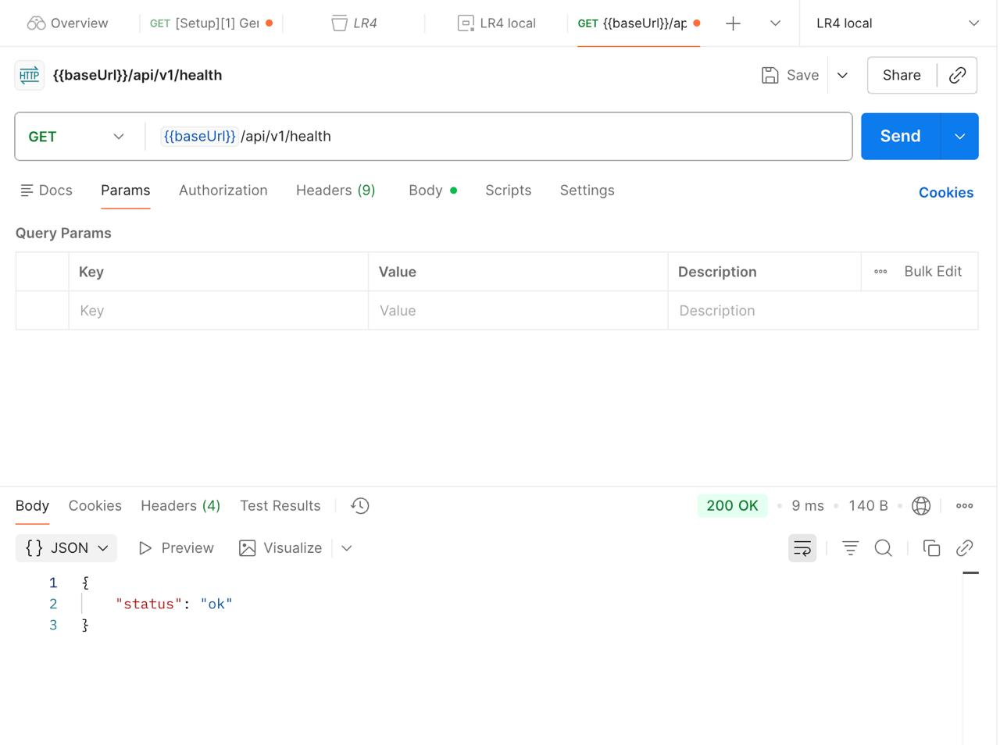


### 3.2 Создание сценария

Название запроса: Создание нового сценария\
Метод: POST\
URL: /api/v1/scenarios

Тело запроса:

``` json
{
  "name": "Сценарий для теста",
  "difficulty": 2
}
```

Что проверяется: корректность создания нового ресурса.

Что должно выводиться: код 200 и объект созданного сценария с уникальным
id.

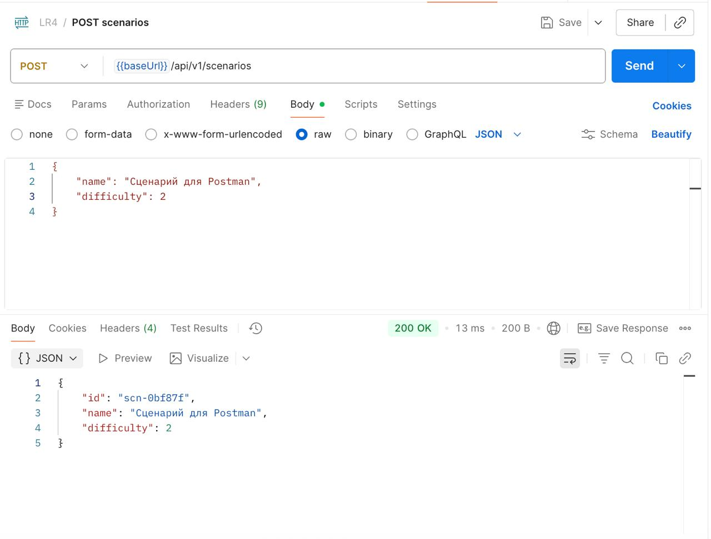


### 3.3 Получение сценария по ID

Название запроса: Получение сценария по ID\
Метод: GET\
URL: /api/v1/scenarios/{scenarioId}

Что проверяется: поиск сценария по идентификатору.

Что должно выводиться: - 200 --- если найден\
- 404 --- если не найден

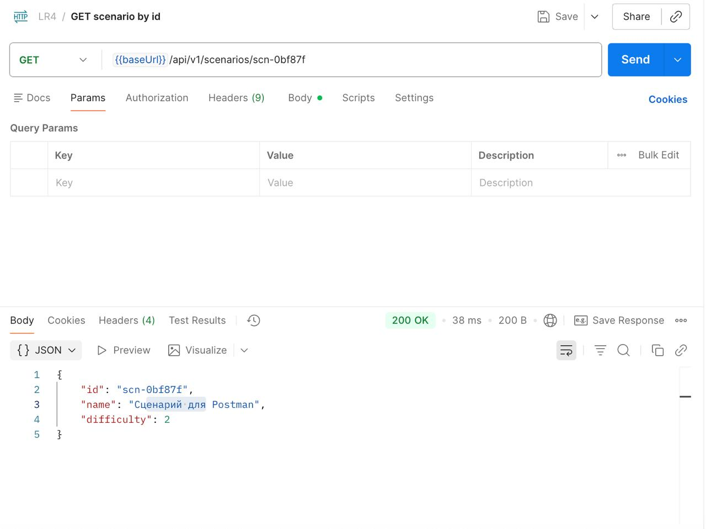
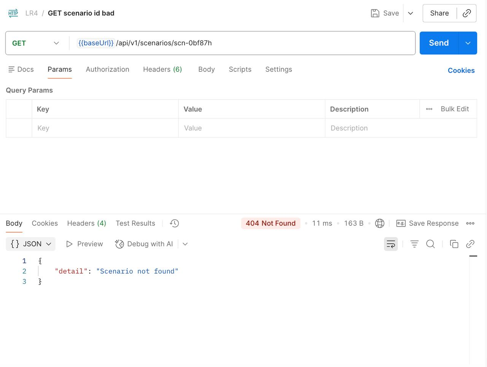


### 3.4 Обновление сценария

Название запроса: Обновление сценария\
Метод: PUT\
URL: /api/v1/scenarios/{scenarioId}

Тело запроса:

``` json
{
  "name": "Сценарий обновлен",
  "difficulty": 9
}
```

Что проверяется: изменение существующего ресурса.

Что должно выводиться: - 200 --- обновлённый объект\
- 404 --- если не найден

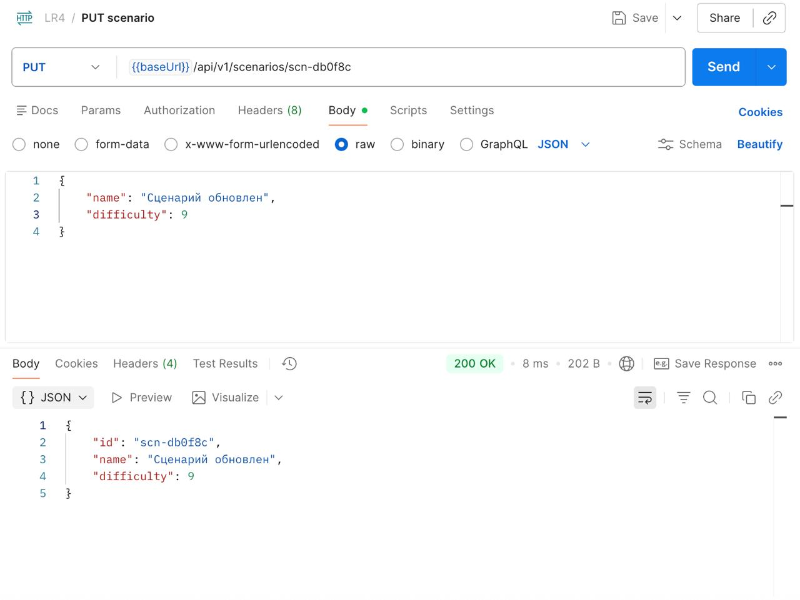


### 3.5 Удаление сценария

Название запроса: Удаление сценария\
Метод: DELETE\
URL: /api/v1/scenarios/{scenarioId}

Что проверяется: удаление ресурса.

Что должно выводиться: - 200 --- подтверждение удаления\
- 404 --- если отсутствует


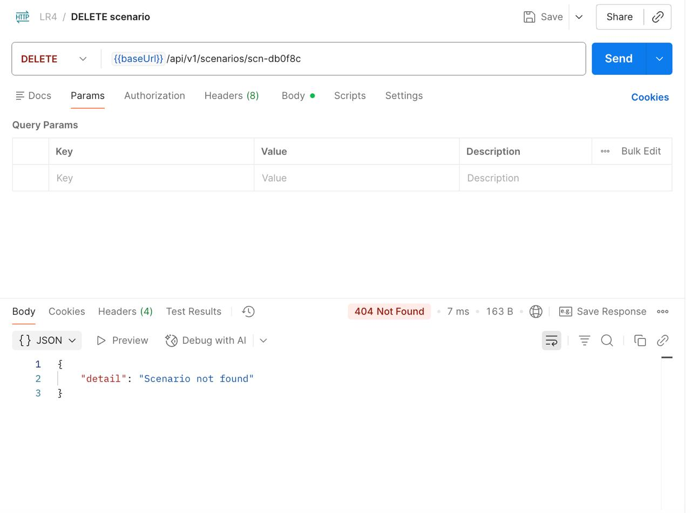


### 3.6 Создание сессии

Название запроса: Создание сессии\
Метод: POST\
URL: /api/v1/sessions

Тело запроса:

``` json
{
  "userId": "usr-1",
  "scenarioId": "scn-123abc"
}
```

Что проверяется: создание новой тренировочной сессии.

Что должно выводиться: - 200 --- созданная сессия\
- 404 --- если сценарий не найден

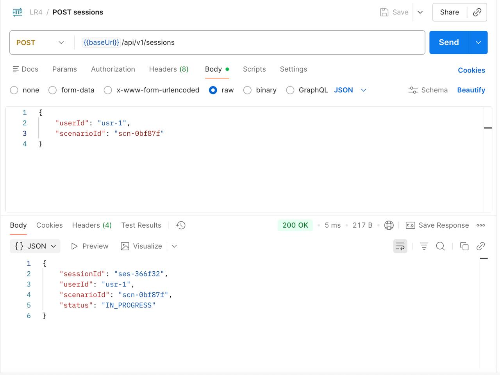

### 3.7 Получение сессии

Название запроса: Получение сессии по ID\
Метод: GET\
URL: /api/v1/sessions/{sessionId}

Что проверяется: корректность получения данных сессии.

Что должно выводиться: - 200 --- объект сессии\
- 404 --- если не найдена

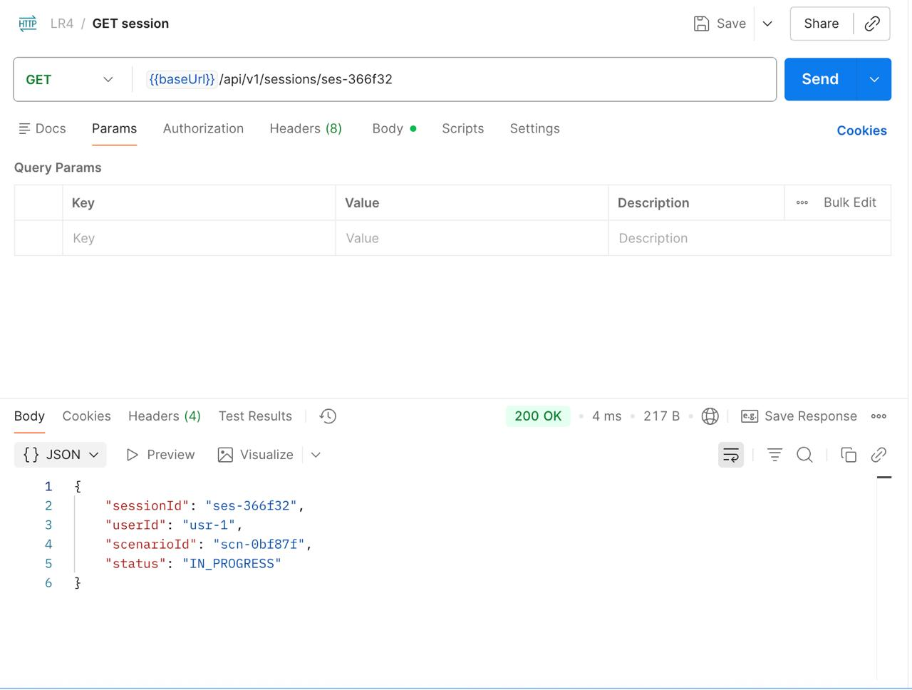

### 3.8 Отправка ответа

Название запроса: Отправка ответа стажёра\
Метод: POST\
URL: /api/v1/sessions/{sessionId}/answer

Тело запроса:

``` json
{
  "answerText": "Предлагаю выгодные условия"
}
```

Что проверяется: передача текстового ответа в рамках активной сессии.

Что должно выводиться: - 200 --- подтверждение приёма ответа\
- 404 --- если сессия не найдена\
- 422 --- неверный формат данных

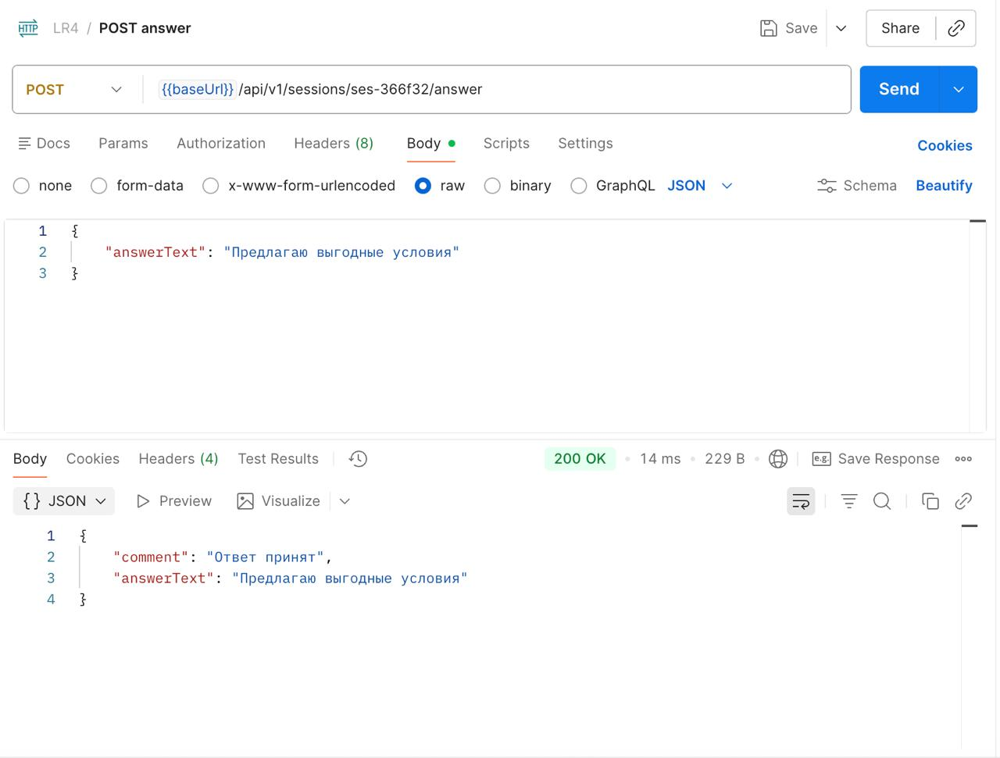

### 3.9 Завершение сессии

Название запроса: Завершение сессии\
Метод: PUT\
URL: /api/v1/sessions/{sessionId}/finish

Что проверяется: изменение статуса сессии на COMPLETED.

Что должно выводиться: - 200 --- обновлённая сессия\
- 404 --- если не найдена

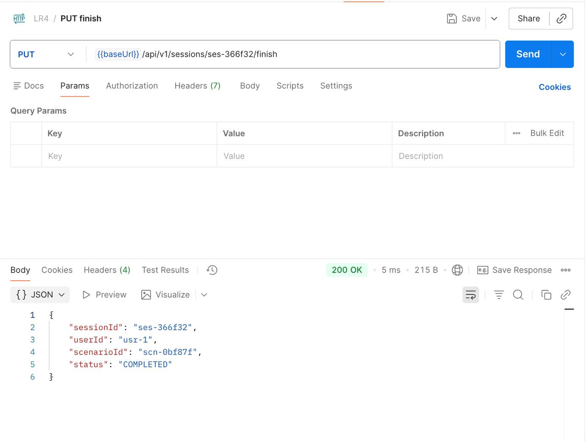

### 3.10 Удаление сценария

Название запроса: Удаление сценария по идентификатору
Метод: DELETE
URL: /api/v1/scenarios/{scenarioId}

Что проверяется:
Корректность удаления существующего ресурса по его уникальному идентификатору.

Что должно выводиться: - 200 --- успешное удаление ресурса из системы\
- 404 --- если не найдена

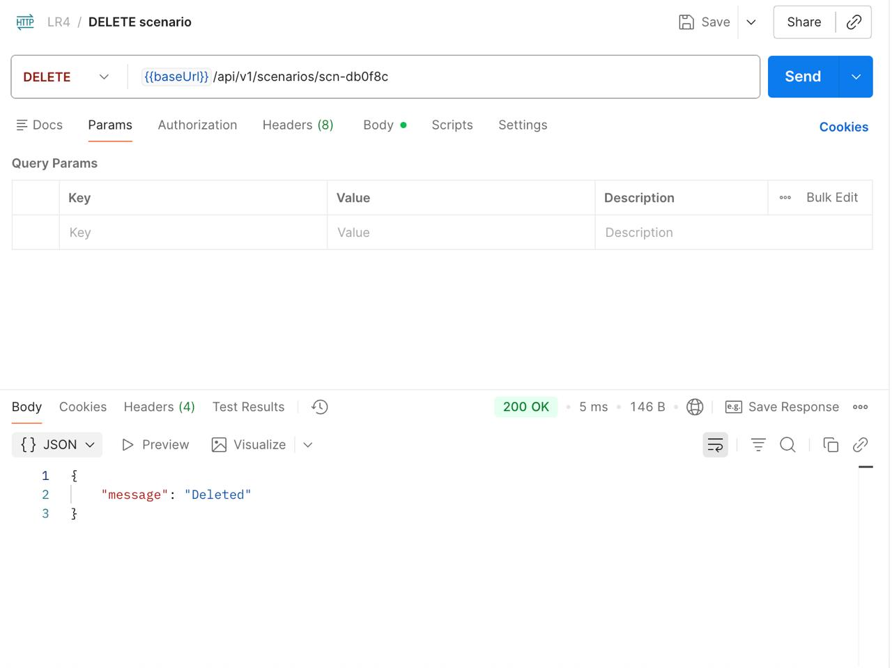
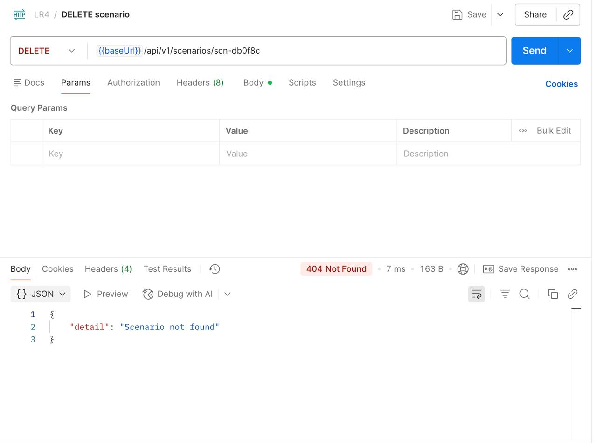


## 4. Вывод

В рамках лабораторной работы был спроектирован и реализован REST API
сервиса диалогового тренажёра. Реализованы методы GET, POST, PUT и
DELETE. Выполнено тестирование всех endpoint с использованием Postman.
Получены практические навыки проектирования и проверки REST-интерфейсов.
