# Лабораторная работа №6

## Тема
Использование шаблонов проектирования

## Цель работы
Получить опыт применения шаблонов проектирования при написании кода программной системы.

## Введение

В качестве основы для лабораторной работы использован код проекта из лабораторной работы №5. В пятой лабораторной работе было реализовано service-based приложение модуля диалогового тренажёра и чат-бота, включающее серверную часть, несколько сервисов, контейнеризацию, интеграционные тесты и непрерывную интеграцию. Поэтому в рамках шестой лабораторной работы не потребовалось создавать новый проект с нуля: анализ шаблонов проектирования был выполнен на основе уже реализованной системы.

Рассматриваемый проект включает несколько ключевых частей: модуль управления сценариями, модуль управления тренировочными сессиями, модуль оценки ответов, чат-бота, а также вспомогательные компоненты, связанные с конфигурацией, интеграцией с внешними сервисами и логированием. Именно на этих частях системы и был выполнен анализ шаблонов GoF и GRASP.

---

## Шаблоны проектирования GoF

## Порождающие шаблоны

### 1. Singleton

**Общее назначение шаблона.**  
Шаблон Singleton нужен для того, чтобы в системе существовал только один экземпляр определённого класса, а доступ к нему был централизованным. Обычно такой подход применяют для конфигурации, логирования, менеджеров соединений или других объектов, которые должны быть общими для всего приложения.

**Назначение в проекте.**  
В рассматриваемой системе этот шаблон используется для конфигурации сервиса. Конфигурация содержит общие параметры работы приложения: имя сервиса, режим генерации ответов, базовые настройки и другие значения, которые должны использоваться всеми частями программы одинаково. Создавать новый объект конфигурации в каждом месте было бы неудобно и избыточно, поэтому используется единый экземпляр.

**Как работает в проекте.**  
При первом обращении объект конфигурации создаётся, а при всех последующих — возвращается уже существующий экземпляр. За счёт этого весь код работает с одной и той же конфигурацией. Это удобно и с точки зрения сопровождения, и с точки зрения единообразия поведения системы.

**Почему это полезно.**  
Использование Singleton упрощает доступ к общим настройкам и исключает ситуацию, когда разные части программы случайно работают с разными экземплярами конфигурации. Кроме того, такой подход делает код более предсказуемым.

**Итог.**  
Шаблон Singleton в проекте помогает централизованно управлять конфигурацией приложения и обеспечивает единое состояние настроек во всех модулях.

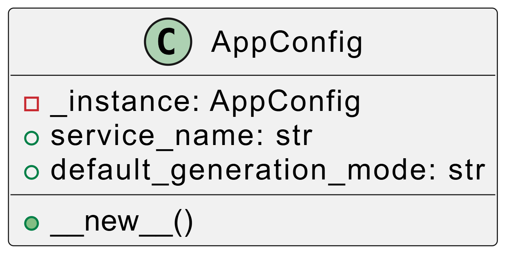
---

### 2. Factory Method

**Общее назначение шаблона.**  
Factory Method используется для вынесения логики создания объектов в отдельный метод или класс. Благодаря этому клиентский код не зависит от конкретных реализаций и не занимается прямым созданием нужных объектов.

**Назначение в проекте.**  
В проекте Factory Method применяется при создании объекта, отвечающего за оценку ответа пользователя. В зависимости от режима работы системы может использоваться разная логика проверки: например, более мягкая для тренировочного режима или более строгая для экзаменационного.

**Как работает в проекте.**  
Вместо того чтобы в коде напрямую создавать конкретный класс оценщика, используется фабрика. Она получает информацию о режиме и возвращает подходящий объект. В результате остальная часть приложения работает с общей абстракцией и не зависит от того, какая именно реализация была выбрана.

**Почему это полезно.**  
Такой подход делает систему более гибкой. Если в будущем появится новый режим оценки или новая стратегия проверки ответа, её можно будет добавить через фабрику, почти не меняя остальной код. Это особенно важно для расширяемых проектов.

**Итог.**  
Factory Method в данном проекте изолирует создание объектов оценивания и позволяет удобно переключаться между различными режимами анализа ответа.

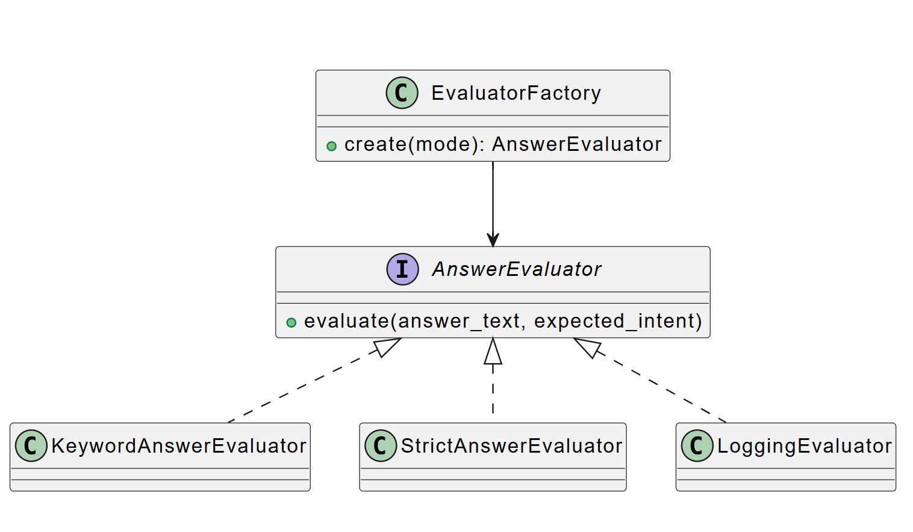
---

### 3. Abstract Factory

**Общее назначение шаблона.**  
Abstract Factory предназначен для создания семейств взаимосвязанных объектов. Он полезен в тех случаях, когда необходимо формировать не один объект, а целый набор согласованных между собой компонентов.

**Назначение в проекте.**  
В проекте идея абстрактной фабрики проявляется на уровне архитектурного решения. Для разных режимов работы системы можно формировать разные согласованные наборы объектов, связанных с оцениванием, логированием и поведением сессии. Например, в одном режиме может использоваться базовый оценщик, а в другом — более строгий оценщик с дополнительным логированием.

**Как работает в проекте.**  
На текущем этапе реализации данная идея выражена в упрощённом виде через расширяемую фабрику оценщиков. Однако сама структура кода уже подготовлена к тому, чтобы в дальнейшем разделить создание объектов по режимам и получить полноценную абстрактную фабрику.

**Почему это полезно.**  
Этот подход позволяет не просто создавать отдельные объекты, а сразу подбирать набор взаимно совместимых компонентов. В результате код становится более организованным и лучше приспособленным к развитию системы.

**Итог.**  
Abstract Factory в проекте пока реализован на концептуальном уровне, но уже заложен в архитектуру и демонстрирует готовность системы к расширению без переработки основных сервисов.

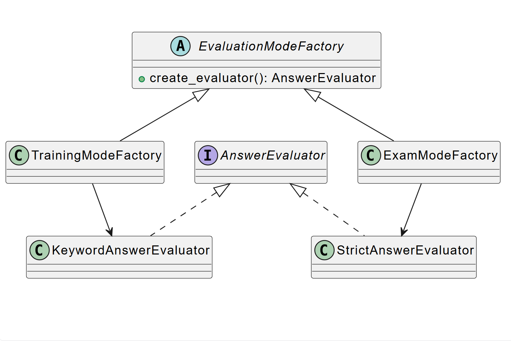
---

## Структурные шаблоны

### 4. Adapter

**Общее назначение шаблона.**  
Adapter нужен для того, чтобы связать между собой объекты с несовместимыми интерфейсами. Он особенно полезен при интеграции внешних сервисов или библиотек, когда внутреннему коду приложения нужен один интерфейс, а внешний модуль предоставляет другой.

**Назначение в проекте.**  
В проекте адаптер используется для работы с внешним LLM-интерфейсом. Внешний API работает в собственном формате, но внутри приложения удобнее использовать единый понятный интерфейс клиента языковой модели.

**Как работает в проекте.**  
Адаптер получает запрос от внутреннего кода в привычном формате, преобразует его в формат внешнего API, отправляет запрос и затем приводит полученный ответ к удобному виду. Таким образом, основной код приложения не зависит от деталей конкретного внешнего сервиса.

**Почему это полезно.**  
Если в будущем потребуется заменить поставщика LLM или изменить способ обращения к нему, основная бизнес-логика практически не пострадает. Достаточно будет изменить адаптер, а остальная система продолжит работать с тем же интерфейсом.

**Итог.**  
Adapter в проекте изолирует внешний LLM-сервис от внутренней логики системы и делает интеграцию более устойчивой и удобной для сопровождения.

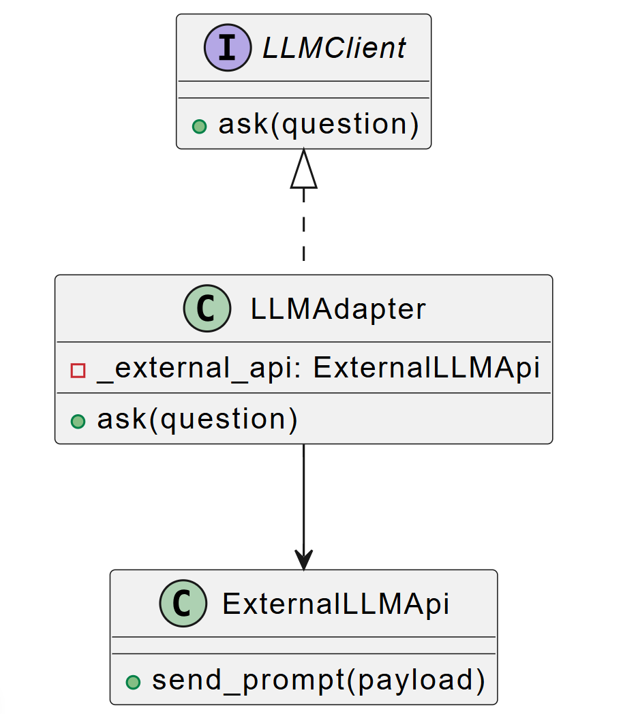
---

### 5. Decorator

**Общее назначение шаблона.**  
Decorator позволяет добавлять объекту новое поведение без изменения его исходного класса. Это особенно удобно, когда нужно расширить функциональность, не нарушая существующую архитектуру.

**Назначение в проекте.**  
В проекте декоратор используется для добавления логирования к процессу оценки ответа пользователя. Базовый оценщик занимается только своей основной задачей — анализирует ответ и формирует результат. Логирование же подключается отдельно, поверх этого поведения.

**Как работает в проекте.**  
Сначала создаётся основной объект оценщика, затем он оборачивается в декоратор, который перехватывает вызов и дополняет его логированием. При этом сама логика оценки не меняется. Благодаря такому подходу можно добавлять и другие дополнительные функции аналогичным способом.

**Почему это полезно.**  
Декоратор помогает не перегружать базовые классы лишней ответственностью. Вместо того чтобы смешивать оценивание и логирование в одном месте, их можно разделить, что делает код чище и проще для поддержки.

**Итог.**  
Decorator в системе позволяет расширять поведение оценщика без изменения его основного класса и поддерживает принцип разделения ответственностей.

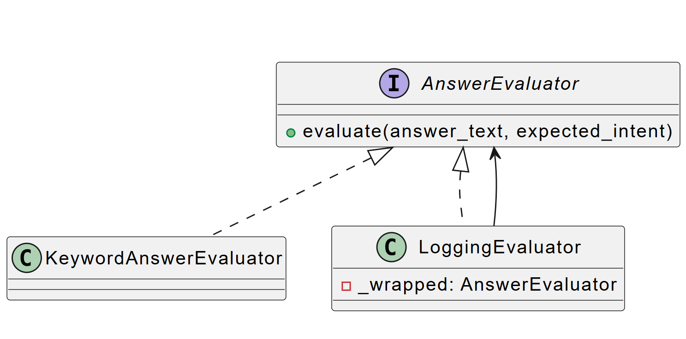
---

### 6. Proxy

**Общее назначение шаблона.**  
Proxy предоставляет объект-заместитель, который управляет доступом к другому объекту или действию. Его часто используют для контроля доступа, отложенной загрузки, логирования или ограничения выполнения операций.

**Назначение в проекте.**  
В проекте прокси применяется для отправки аналитических событий. Не всегда требуется, чтобы аналитика отправлялась напрямую из бизнес-логики. Более удобно использовать промежуточный объект, который решает, нужно ли выполнять это действие.

**Как работает в проекте.**  
Сервис обращается не напрямую к аналитической подсистеме, а к прокси-объекту. Тот, в зависимости от конфигурации, либо отправляет событие, либо пропускает его. Благодаря этому код основного сервиса остаётся проще и не зависит от деталей настройки аналитики.

**Почему это полезно.**  
Это решение позволяет централизованно контролировать отправку аналитики и при необходимости включать или отключать её без изменения основной логики приложения.

**Итог.**  
Proxy в проекте служит промежуточным слоем между бизнес-логикой и аналитикой, упрощая контроль за дополнительными действиями системы.

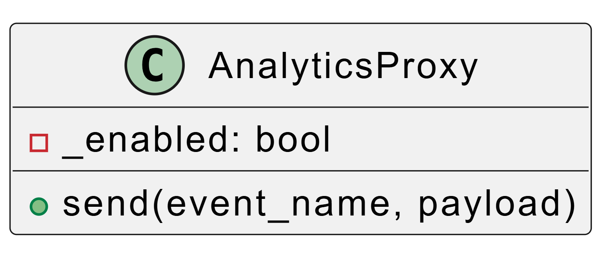
---

### 7. Facade

**Общее назначение шаблона.**  
Facade предоставляет простой интерфейс к более сложной подсистеме. Он скрывает внутренние детали и объединяет несколько операций в один понятный сценарий вызова.

**Назначение в проекте.**  
В проекте роль фасада выполняет сервис управления тренировочной сессией. Для клиента или API-слоя работа с тренировкой выглядит как единый процесс: создать сессию, получить состояние, отправить ответ, завершить тренировку. При этом внутри выполняется несколько разных действий: работа с репозиторием, обращение к оценщику, изменение состояния сессии, подготовка результата.

**Как работает в проекте.**  
Внешний слой взаимодействует с сервисом как с одной точкой входа. Сам сервис уже координирует внутренние вызовы и скрывает от клиента детали организации логики.

**Почему это полезно.**  
Такой подход уменьшает связанность между слоями приложения. Контроллеры и другие клиенты не обязаны знать, как именно устроена обработка тренировочной сессии внутри.

**Итог.**  
Facade в проекте упрощает взаимодействие с подсистемой управления сессиями и делает API более понятным и устойчивым.

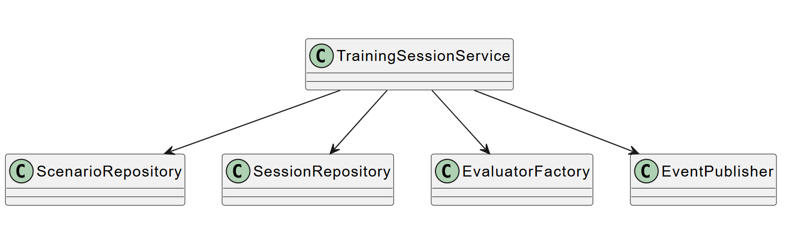
---

## Поведенческие шаблоны

### 8. Strategy

**Общее назначение шаблона.**  
Strategy используется тогда, когда существует несколько вариантов поведения, и нужно уметь выбирать между ними во время работы программы. Вместо большого количества условных операторов система опирается на набор взаимозаменяемых стратегий.

**Назначение в проекте.**  
В системе стратегия используется для разных способов оценки ответа пользователя. В зависимости от режима работы можно применять более мягкую проверку по ключевым словам или более строгую экспертную оценку.

**Как работает в проекте.**  
Все варианты оценки реализуют общий интерфейс. Сервис, который отвечает за тренировочную сессию, работает не с конкретным классом, а с абстракцией. Это позволяет подменять стратегию без изменения логики сессии.

**Почему это полезно.**  
Шаблон облегчает расширение функциональности. Добавление новой стратегии не требует переписывания существующего сервиса, что особенно важно для обучающих систем, где правила оценки могут меняться.

**Итог.**  
Strategy делает механизм оценки гибким и расширяемым.

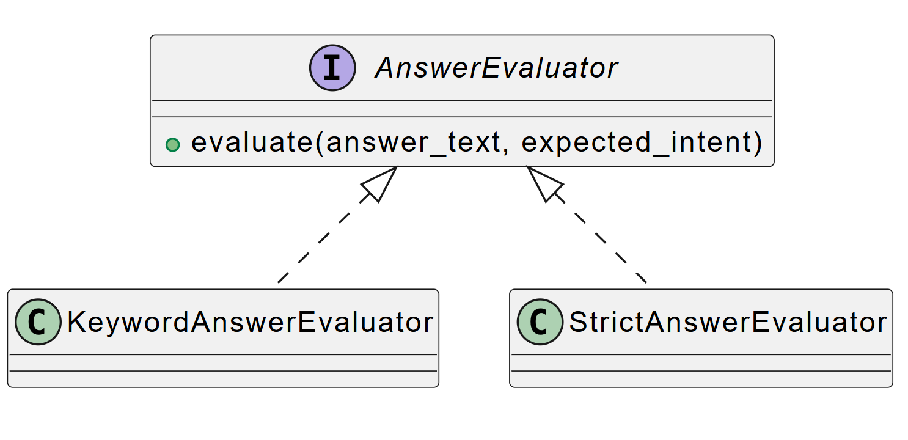
---

### 9. Template Method

**Общее назначение шаблона.**  
Template Method определяет общий каркас алгоритма, а отдельные шаги могут быть переопределены в подклассах или конкретных реализациях.

**Назначение в проекте.**  
В проекте данный подход проявляется в общем процессе обработки ответа пользователя. Независимо от конкретного оценщика всегда выполняются одни и те же этапы: принять ответ, подготовить данные, оценить результат, вернуть итоговую структуру.

**Как работает в проекте.**  
Общий сценарий остаётся неизменным, но конкретный способ оценки зависит от выбранной реализации. Таким образом сохраняется единая логика выполнения процесса и одновременно обеспечивается гибкость.

**Почему это полезно.**  
Это позволяет поддерживать единообразие поведения системы и уменьшает вероятность ошибок, когда разные реализации начинают работать по совершенно разным правилам.

**Итог.**  
Template Method помогает сохранить общий алгоритм обработки ответа и при этом позволяет изменять отдельные шаги.

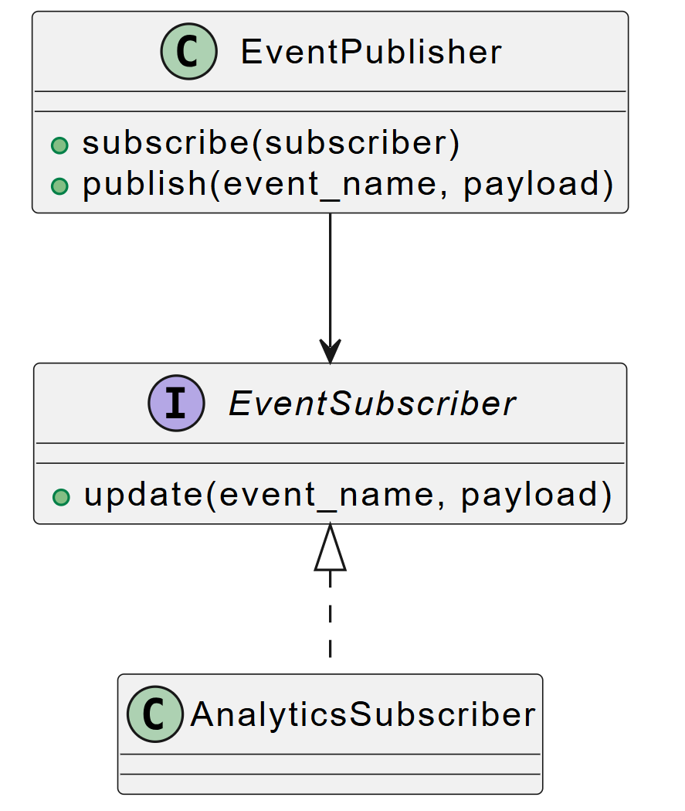
---

### 10. Observer

**Общее назначение шаблона.**  
Observer используется в тех случаях, когда изменение состояния одного объекта должно вызывать уведомление других объектов.

**Назначение в проекте.**  
В проекте элементы наблюдателя можно увидеть в механизме аналитики и логирования. Когда в системе происходит значимое действие, например завершение сессии или получение ответа пользователя, на это могут реагировать дополнительные подсистемы: аналитика, журналирование, мониторинг.

**Как работает в проекте.**  
Основной сервис выполняет свою работу, а вспомогательные подсистемы получают информацию о событии и реагируют на него отдельно. Даже если полноценная реализация Observer в учебном проекте представлена в упрощённом виде, сама идея событийного взаимодействия уже прослеживается.

**Почему это полезно.**  
Такой подход помогает не смешивать основную бизнес-логику и побочные действия, например сбор аналитики или вывод диагностической информации.

**Итог.**  
Observer в проекте позволяет отделить основную бизнес-логику от реакций на события и облегчает расширение системы.

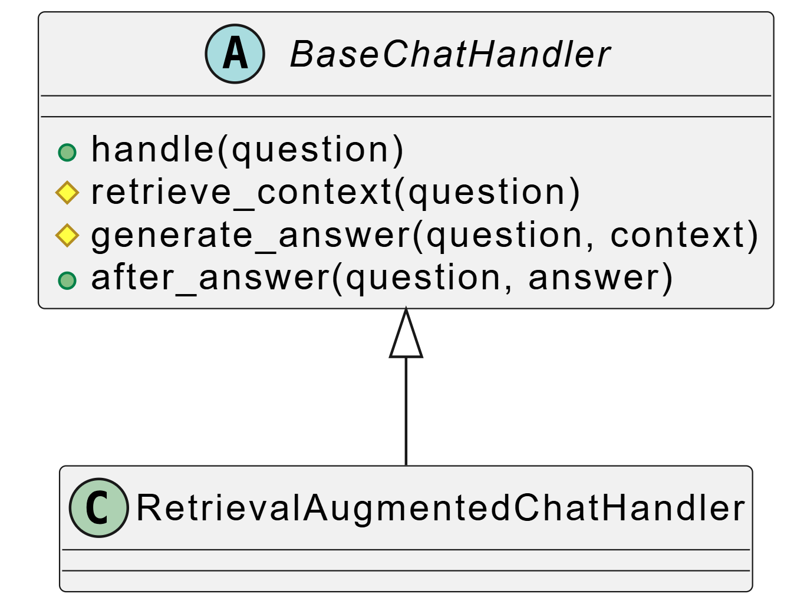
---

### 11. Command

**Общее назначение шаблона.**  
Command представляет действие в виде отдельного объекта. Это удобно, когда нужно отделить инициатора действия от его выполнения.

**Назначение в проекте.**  
В проекте команды хорошо соотносятся с действиями API: создание сценария, создание сессии, отправка ответа, завершение сессии. Каждое такое действие можно рассматривать как отдельную операцию, имеющую входные данные и ожидаемый результат.

**Как работает в проекте.**  
Запрос пользователя или клиента преобразуется в конкретное действие, которое затем обрабатывается сервисом. Такой подход особенно полезен в архитектуре, где операции должны быть чётко разграничены.

**Почему это полезно.**  
Это делает бизнес-действия более явными, а код — более понятным и структурированным. Кроме того, такой подход упрощает тестирование отдельных операций.

**Итог.**  
Command помогает представить действия системы как отдельные логические операции, что полезно для API-ориентированного приложения.

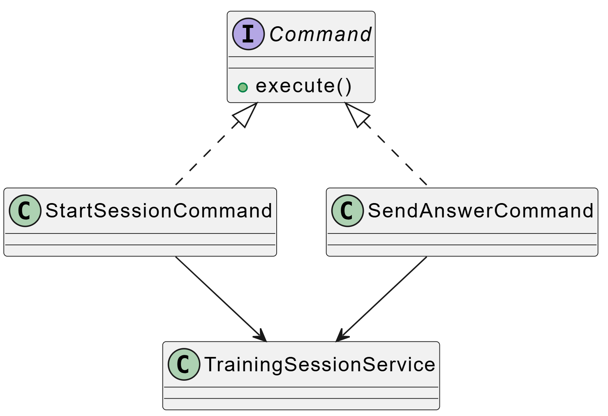
---

### 12. State

**Общее назначение шаблона.**  
State позволяет объекту менять своё поведение в зависимости от текущего состояния.

**Назначение в проекте.**  
В тренировочной системе сессия естественным образом проходит через разные состояния: создана, активна, завершена. В зависимости от этого система либо позволяет отправлять ответы, либо запрещает дальнейшие действия.

**Как работает в проекте.**  
Хотя в учебном проекте это может быть реализовано через поля и проверки, сама логика полностью соответствует паттерну State: поведение объекта зависит от его текущего статуса.

**Почему это полезно.**  
Такой подход делает систему более корректной с точки зрения бизнес-логики. Например, нельзя завершить уже завершённую сессию или отправить ответ в закрытую тренировку.

**Итог.**  
State помогает поддерживать корректный жизненный цикл тренировочной сессии и делает поведение системы более логичным.

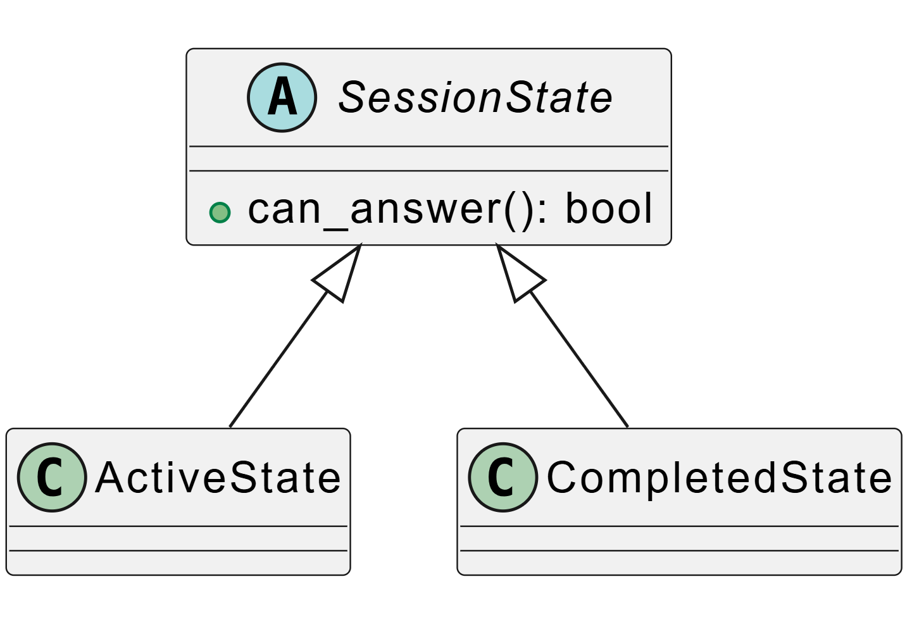
---

## Шаблоны проектирования GRASP

## Роли (обязанности) классов

### 1. Information Expert

**Проблема.**  
Нужно понять, какому классу следует поручить выполнение операции, если для этого требуется определённая информация.

**Решение в проекте.**  
Ответственность передаётся тому классу, который уже обладает необходимыми данными. Например, сервис управления сессией работает с данными о состоянии тренировочной сессии, а сервис оценки работает с логикой анализа ответа.

**Результат.**  
Такое распределение обязанностей делает проект более логичным: каждый класс решает те задачи, для которых у него уже есть нужная информация.

**Связь с другими паттернами.**  
Данный принцип хорошо сочетается с Facade, Strategy и State.

---

### 2. Creator

**Проблема.**  
Нужно определить, какой класс должен создавать объекты другого класса.

**Решение в проекте.**  
Создание сущностей и вспомогательных объектов передаётся тем классам, которые непосредственно работают с ними или управляют их жизненным циклом. Например, фабрика создаёт оценщики, а сервис сессий инициирует создание новой тренировочной сессии.

**Результат.**  
Создание объектов становится более организованным, а логика работы приложения — понятнее.

**Связь с другими паттернами.**  
Тесно связан с Factory Method и Abstract Factory.

---

### 3. Controller

**Проблема.**  
Необходимо определить объект, который будет принимать внешние запросы системы и передавать их на выполнение внутренним компонентам.

**Решение в проекте.**  
Такую роль выполняет API-слой. Контроллеры принимают HTTP-запросы, валидируют входные данные и вызывают сервисы предметной области.

**Результат.**  
Внешний интерфейс отделён от внутренней бизнес-логики. Это упрощает поддержку, тестирование и развитие системы.

**Связь с другими паттернами.**  
Связан с Facade и Command.

---

### 4. Low Coupling

**Проблема.**  
Если классы слишком сильно зависят друг от друга, систему сложно изменять и тестировать.

**Решение в проекте.**  
В проекте используются абстракции сервисов, интерфейсы клиентов и выделенные слои. Например, логика оценивания отделена от логики сессий, а внешние интеграции скрыты за адаптерами.

**Результат.**  
Система становится более гибкой, отдельные части можно изменять или заменять с минимальным влиянием на остальные.

**Связь с другими паттернами.**  
Поддерживается Adapter, Strategy, Factory Method и Facade.

---

### 5. High Cohesion

**Проблема.**  
Если класс выполняет слишком много разнородных задач, код становится трудным для понимания и сопровождения.

**Решение в проекте.**  
Классы распределены по обязанностям: одни управляют сессиями, другие оценивают ответы, третьи работают с интеграциями, четвёртые отвечают за конфигурацию.

**Результат.**  
Каждый модуль остаётся относительно компактным и отвечает за ограниченный круг задач.

**Связь с другими паттернами.**  
Поддерживается Decorator, Strategy и Controller.

---

## Принципы разработки

### 1. Полиморфизм

**Проблема.**  
Нужно обрабатывать разные варианты поведения единым способом, не перегружая код множеством условных операторов.

**Решение в проекте.**  
Разные оценщики ответа реализуют общий интерфейс. Сервис сессий может работать с ними одинаково, независимо от конкретного типа.

**Результат.**  
Снижается сложность кода, повышается расширяемость и улучшается читаемость.

**Связь с другими паттернами.**  
Напрямую связан со Strategy, Decorator и Factory Method.

---

### 2. Pure Fabrication

**Проблема.**  
Иногда удобнее выделить искусственный сервисный класс, который не является сущностью предметной области, но помогает правильно распределить ответственность.

**Решение в проекте.**  
Примером могут служить фабрики, адаптеры, прокси и специальные сервисы интеграции. Они не являются бизнес-сущностями вроде сценария или сессии, но помогают организовать архитектуру.

**Результат.**  
Уменьшается связанность между реальными доменными сущностями и техническими деталями системы.

**Связь с другими паттернами.**  
Связан с Adapter, Proxy, Factory Method.

---

### 3. Indirection

**Проблема.**  
Если два компонента напрямую зависят друг от друга, их сложно независимо изменять.

**Решение в проекте.**  
Для снижения зависимости вводятся промежуточные уровни: сервисы, адаптеры, фабрики, прокси. Они играют роль посредников между компонентами.

**Результат.**  
Система становится менее жёстко связанной и лучше приспособленной к изменениям.

**Связь с другими паттернами.**  
Поддерживается Adapter, Proxy, Facade и Factory Method.

---

## Свойство программы (цель)

### Поддерживаемость и расширяемость

**Проблема.**  
Проект диалогового тренажёра и чат-бота предполагает развитие: могут появляться новые режимы тренировки, новые алгоритмы оценки, новые внешние интеграции, новые сценарии и аналитические модули. Если код изначально организован неудачно, внесение изменений становится трудоёмким.

**Решение в проекте.**  
Для обеспечения расширяемости в проекте используются шаблоны проектирования и GRASP-принципы. Логика создания объектов отделена от их использования, внешние интеграции скрыты за адаптерами, дополнительные функции подключаются через декораторы, а основные операции объединены через сервисы и фасады.

**Результаты, которые достигаются.**  
Система становится более удобной для сопровождения и развития. Можно добавлять новые типы оценщиков, менять правила анализа, заменять внешние сервисы и развивать внутреннюю архитектуру без полной переработки проекта. Это особенно важно для учебного проекта, который в дальнейшем может стать основой выпускной квалификационной работы или более крупого решения.

**Связь с другими паттернами.**  
Данная цель достигается за счёт совместного использования Singleton, Factory Method, Adapter, Decorator, Facade, Strategy и GRASP-принципов Low Coupling и High Cohesion.

---

## Вывод

В ходе выполнения лабораторной работы №6 был проведён анализ кода проекта, созданного в лабораторной работе №5, с точки зрения применения шаблонов проектирования GoF и GRASP. Было показано, что даже учебное service-based приложение может быть организовано на основе устойчивых архитектурных решений, если заранее продумано распределение ответственностей между слоями и компонентами.

В проекте были выделены порождающие, структурные и поведенческие шаблоны, а также роли и принципы GRASP. Их использование позволило сделать систему более гибкой, расширяемой, понятной и удобной для сопровождения. Особенно важно, что анализ выполнялся не на абстрактных примерах, а на уже реализованном приложении, что подтверждает практическую ценность рассмотренных шаблонов.

Таким образом, поставленная цель лабораторной работы достигнута: были изучены и продемонстрированы шаблоны проектирования, применимые к программной системе, а также показано, как они помогают улучшить структуру и качество кода.
